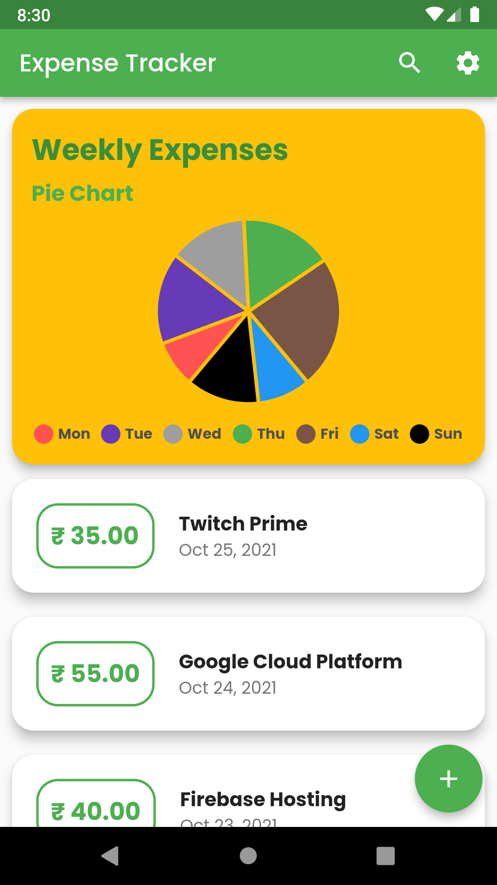
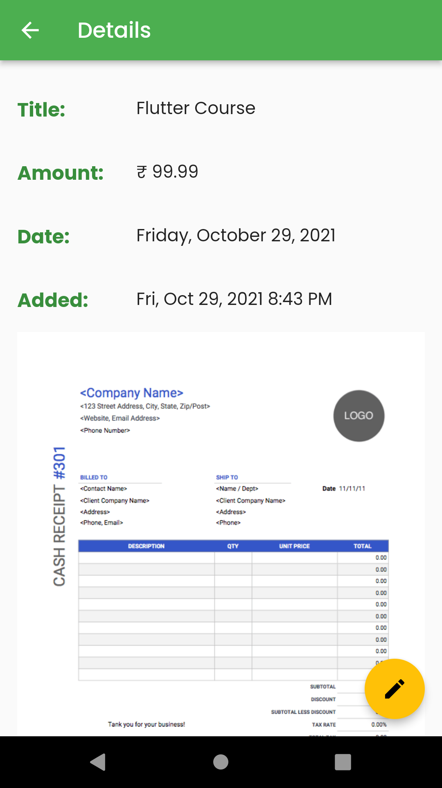
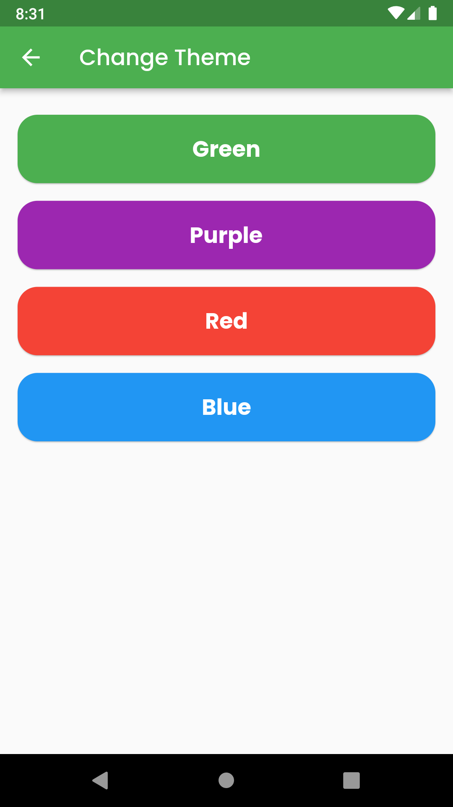

# Smart Expense & Budget Tracker for Students

A Flutter app designed to help students manage their personal finances effectively.

With this app, users can log daily expenses, categorize spending, and set monthly budgets to stay on track. It features real-time visualizations, such as weekly bar graphs, to analyze spending habits and track financial goals.

Additional features include savings goal tracking, budget alerts for overspending, and the ability to delete or update logged transactions. Offline storage ensures that all financial data remains accessible even without an internet connection, offering convenience and privacy.

# Run The App on Your Android Device Now

  

## Details

• [BLOC](https://github.com/felangel/bloc/tree/master/packages/flutter_bloc) for State Management

• [FL_Chart](https://pub.dev/packages/fl_chart) for Bar and Pie Chart

• [Google AdMob](https://admob.google.com/) for showing Banner Ads

• [sqflite](https://pub.dev/packages/sqflite) for database operations 

## Screenshots

       

### Track your expenses. See Weekly Bar Graph and Pie Chart. Made with Flutter.

• Private – No Tracking. All your expenses data remains on your phone. If you uninstall the app the data is automatically deleted.

• Simple – Easy to add, update, search and delete all your expenses.

• Add Pictures – Add pictures of bills to keep track of your spendings.

# Technology Stack
List the technologies, libraries, and frameworks used:

- Flutter: Framework for building the app.
- Dart: Programming language.
- BLoC (Business Logic Component): State management solution.
- Sqflite: Local database storage.
- Firebase: Authentication and notifications.

  ---------------------------------------------------------------------------------------------------------------------------------------
# Names : Kigero Kanyana Daniella
# Id : 24652
